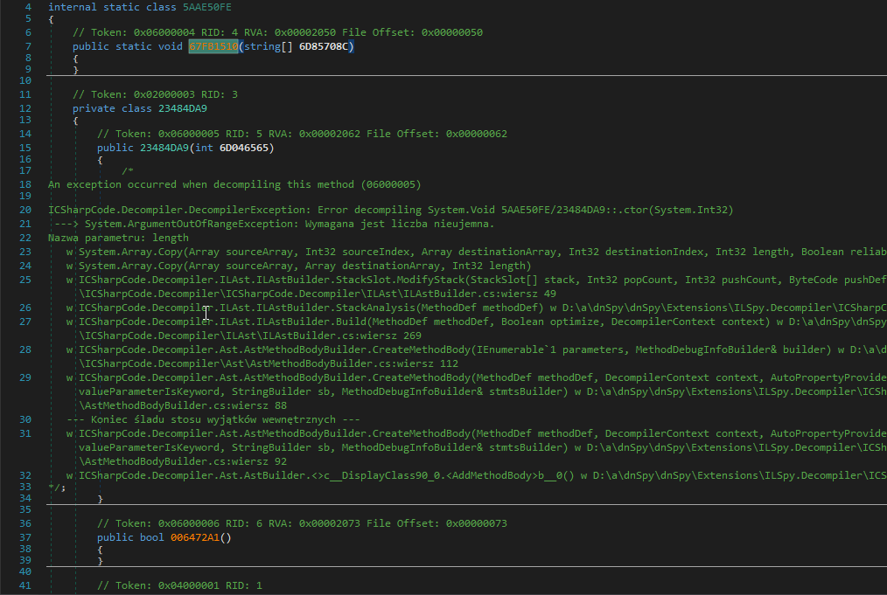

<p align="center">
  
<h1 align="center">VMUnprotect.Dumper</h1>
<p align="center">
  <strong>VMUnprotect.Dumper</strong> is a project engaged in hunting tampered <strong>VMProtect assemblies</strong>. It makes use of <a href="https://github.com/pardeike/Harmony">AsmResolver</a> to dynamically unpack <strong>VMP</strong> protected assembly. Works on <a href="https://vmpsoft.com/20220827/vmprotect-3-7/">VMProtect 3.7.0</a> (Latest) and few versions back.
</p>
</p>
<p align="center">
  
  
</p>
</p>

</br></br>
# Before usage of VMUnprotect.Dumper


</br></br>

# After usage of VMUnprotect.Dumper


# Usage
```sh
VMUnprotect.Dumper.exe example.vmp.exe
```
> If the target app has a different framework, it probably won't work. Compile it yourself for your needs. <br>

### Checkout also:
* [VMUnprotect](https://github.com/void-stack/VMUnprotect) - VMUnprotect can dynamically log and manipulate calls from virtualized methods by VMProtect.

# Credits
* [wwh1004](https://github.com/wwh1004) - Idea.
* [(Discord) MrToms#1244]() - Resources

This tool uses the following (open source) software:
* [AsmResolver](https://github.com/Washi1337/AsmResolver) by [Washi](https://github.com/Washi1337), licensed under the MIT license, for reading/writing assemblies.

## 💵 Want to buy me a Coffee?
     - Donate BTC at `bc1q048wrqztka5x2syt9mtj68uuf73vqry60s38vf`
     - Donate ETH at `0x86b2C17C94A1E6f35d498d17a37dc1f8A715139b`
