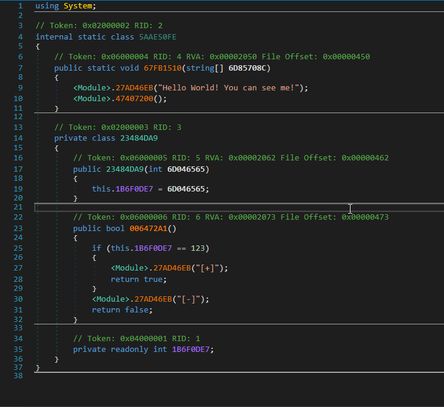

<p align="center">
  
<h1 align="center">VMUnprotect.Dumper</h1>
<p align="center">
  <strong>VMUnprotect.Dumper</strong> is a project engaged in hunting tampered <a href="https://vmpsoft.com">VMProtect</a> assemblies. It makes use of <a href="https://github.com/pardeike/Harmony">AsmResolver</a> to dynamically untamper <strong>VMP</strong> protected assembly. Works on <a href="https://vmpsoft.com/20210919/vmprotect-3-5-1/">VMProtect 3.5.1</a> (Latest) and few versions back.
</p>
</p>
<p align="center">
  
  
</p>
</p>

</br></br>
# Before and after usage of VMUnprotect.Dumper

<div style="display:inline;width:5px;"></div>



# Usage
```sh
VMUnprotect.Dumper.exe example.vmp.exe
```


# Credits
* [wwh1004](https://github.com/wwh1004) - Idea.
* [(Discord) MrToms#1244]() - Resources

This tool uses the following (open source) software:
* [AsmResolver](https://github.com/Washi1337/AsmResolver) by [Washi](https://github.com/Washi1337), licensed under the MIT license, for reading/writing assemblies.

## Want to support this project?
BTC: bc1q048wrqztka5x2syt9mtj68uuf73vqry60s38vf
